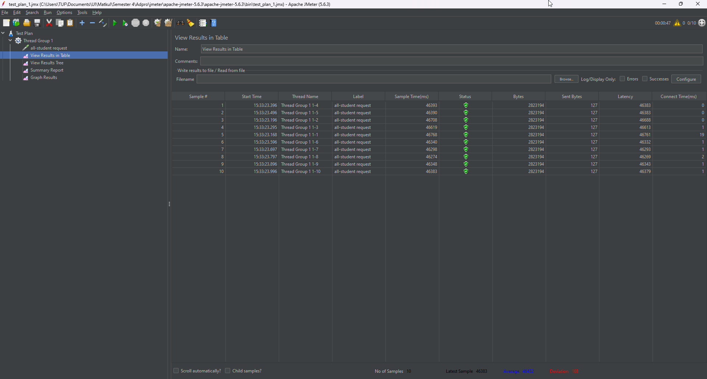
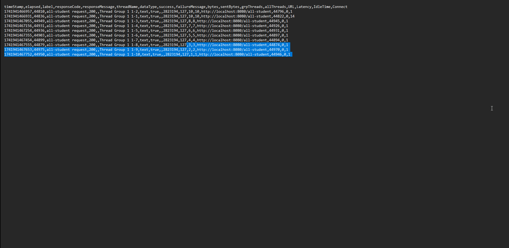
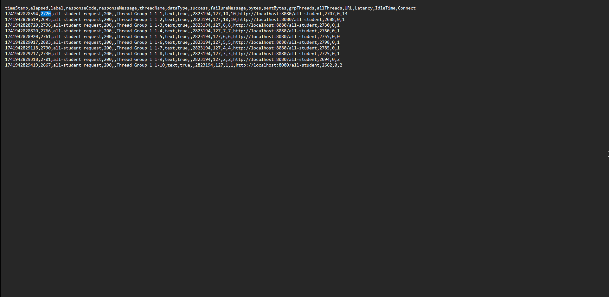
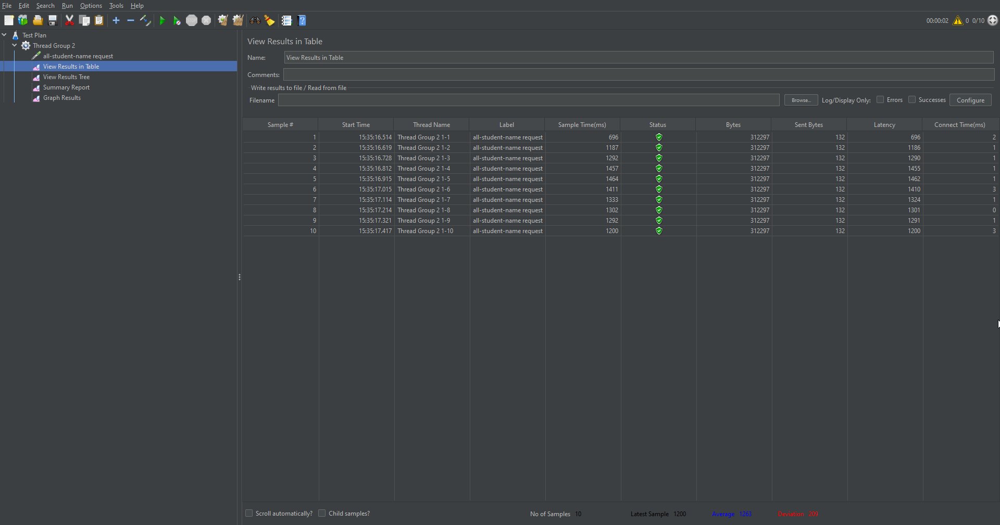
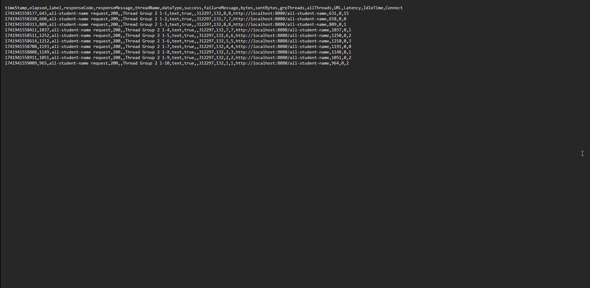
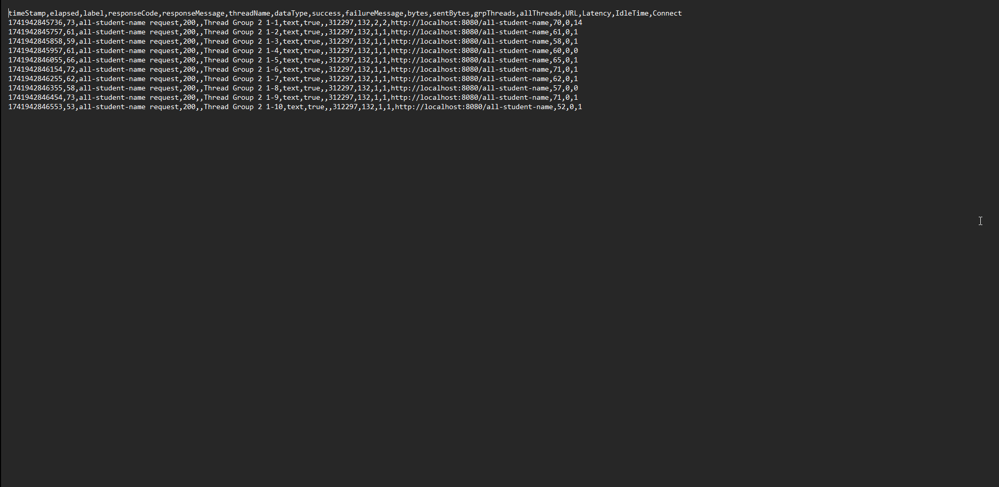
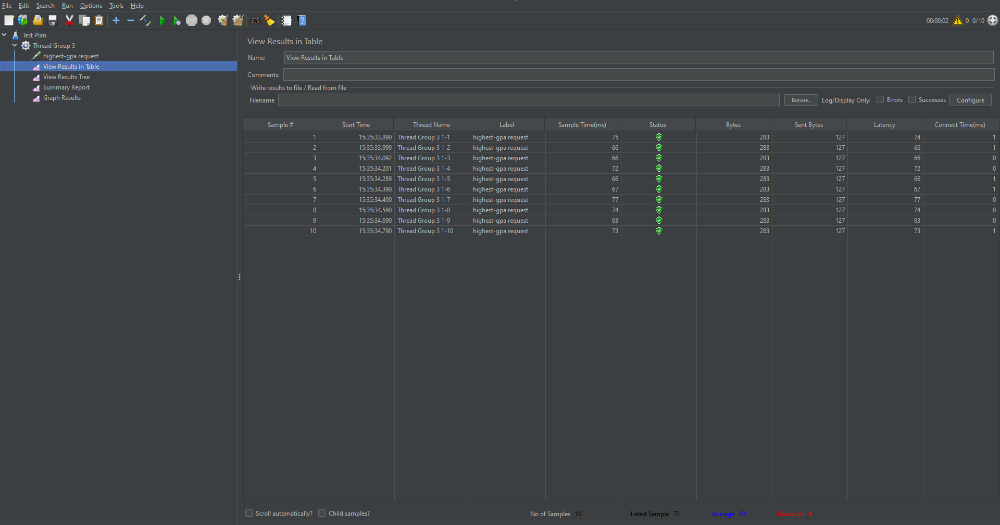
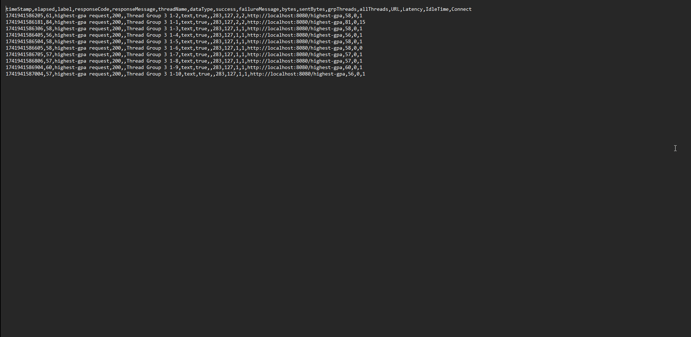
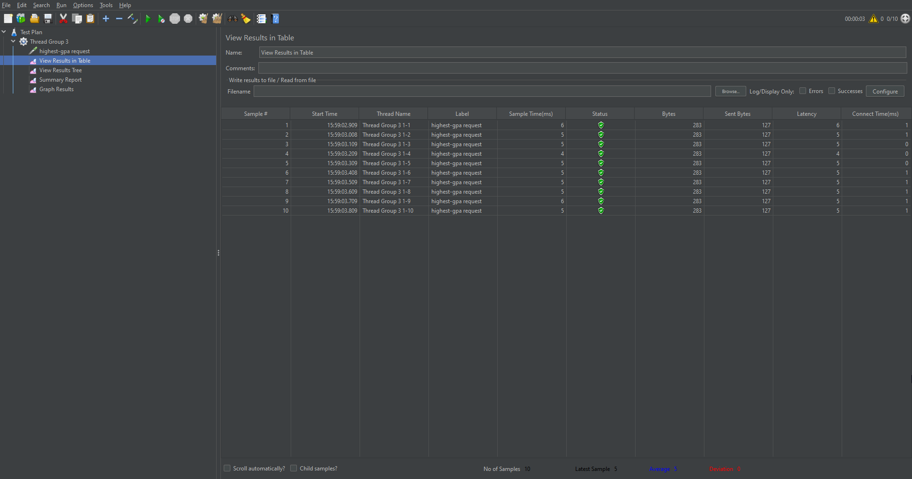
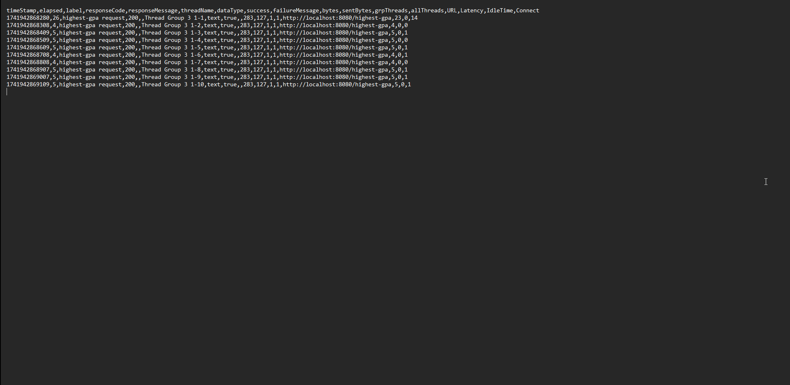

## Optimization Measurements  
### Test Plan 1 (/all-student)
* Before Optimization:  
  JMeter GUI  
    
  JMeter CLI  
    
* After Optimization:  
  JMeter GUI  
    
  JMeter CLI  
    
> The JMeter test results show a significant performance improvement after optimization. Initially, the average sample time was 46,452 ms, with a latest sample time of 46,383 ms, and a deviation of 168 ms. After optimization, these values dropped drastically, with the average sample time reducing to 2,930 ms, the latest sample time to 2,924 ms, and the deviation decreasing to 94 ms, indicating more consistent response times. The substantial reduction in response time and lower deviation suggest that the applied optimizations whether caching, query improvements, server tuning, or load balancing were highly effective. The system is now much faster and more stable, making it more efficient in handling requests.

### Test Plan 2 (/all-student-name)
* Before Optimization:  
  JMeter GUI  
    
  JMeter CLI  
    
* After Optimization:  
  JMeter GUI  
    
  JMeter CLI  
    
> From the JMeter results, a clear improvement is observed after optimization. In the first set of results before optimization, the sample times are significantly higher, with values ranging from approximately 696 ms to 1464 ms. The average sample time before optimization is around 1203 ms with a deviation of 209 ms. However, after optimization, the response times have drastically decreased, with sample times ranging between 60 ms and 72 ms, and an average sample time of only 63 ms with a deviation of 9 ms. This significant reduction in response times and deviation indicates that the optimization has successfully improved the system's performance, leading to faster request handling and reduced variability in response times.

### Test Plan 3 (/highest-gpa)
* Before Optimization:  
  JMeter GUI  
    
  JMeter CLI  
    
* After Optimization:  
  JMeter GUI  
    
  JMeter CLI  
    
> There is a significant improvement in the JMeter performance measurements after optimization. Before optimization, the sample times ranged between 63 ms and 77 ms, with an average of 69 ms and a deviation of 4 ms. After optimization, the sample times drastically dropped to a range of 4 ms to 6 ms, with an average of 5 ms and zero deviation. This indicates that the request processing has become significantly faster and more consistent. Additionally, the latency has also reduced from values around 63–77 ms to just 4–6 ms. This improvement suggests that the optimizations applied have effectively enhanced the efficiency of the system, reducing processing overhead and improving response times.

## Reflection
1. **What is the difference between the approach of performance testing with JMeter and profiling with IntelliJ Profiler in the context of optimizing application performance?**
> JMeter tests overall system performance under load, while IntelliJ Profiler analyzes code execution to find inefficiencies at a granular level. JMeter helps identify system-wide bottlenecks, whereas profiling pinpoints specific slow methods or memory issues.
2. **How does the profiling process help you in identifying and understanding the weak points in your application?**
> Profiling helps by providing insights into CPU usage, memory allocation, and execution time of different methods, making it easier to identify inefficient code and performance bottlenecks.
3. **Do you think IntelliJ Profiler is effective in assisting you to analyze and identify bottlenecks in your application code?**
> Yes, IntelliJ Profiler effectively detects performance issues by visualizing hotspots, tracking memory leaks, and showing method execution times, making it easier to optimize the code.
4. **What are the main challenges you face when conducting performance testing and profiling, and how do you overcome these challenges?**
> Challenges include handling large data sets, interpreting profiling results, and ensuring accurate test conditions. These are overcome by running tests in controlled environments, using profiling filters, and validating findings with multiple runs.
5. **What are the main benefits you gain from using IntelliJ Profiler for profiling your application code?**
> The main benefits include pinpointing inefficient methods, detecting memory leaks, and gaining detailed execution insights, helping to improve application performance through targeted optimizations.
6. **How do you handle situations where the results from profiling with IntelliJ Profiler are not entirely consistent with findings from performance testing using JMeter?**
> If profiling and JMeter results differ, profiling is re-run under load conditions similar to JMeter tests to align results. Discrepancies are analyzed to determine whether they stem from test setup differences or specific code behaviors.
7. **What strategies do you implement in optimizing application code after analyzing results from performance testing and profiling? How do you ensure the changes you make do not affect the application's functionality?**
> Optimization is done by refactoring inefficient code, such as reducing redundant computations, improving loop structures, and optimizing data handling. All changes are carefully tested to ensure they maintain the application's functionality while improving performance.